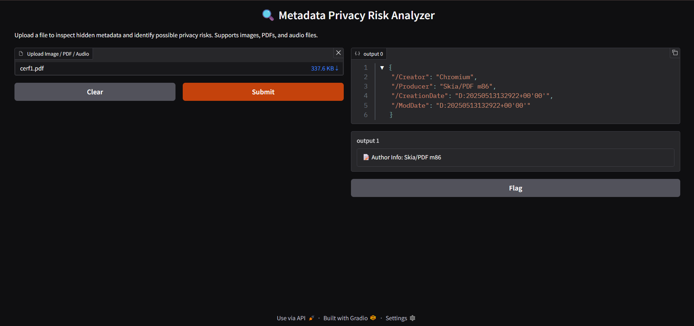

# Metadata Privacy Risk Analyzer

🔍 A simple yet effective tool to inspect hidden metadata in files and identify potential privacy risks. This tool supports **images (JPEG, PNG), PDFs, and audio files (MP3, WAV)** and highlights sensitive metadata like GPS location, device information, author details, and artist info.

---

## Features

- Extracts metadata from:
  - Images (JPEG, PNG) using `exifread`
  - PDFs using `PyPDF2`
  - Audio files (MP3, WAV) using `mutagen`
- Detects privacy risks such as:
  - GPS coordinates embedded in photos
  - Device model and make info
  - PDF author and producer details
  - Audio artist and encoding metadata
- Provides user-friendly output via a web interface built with [Gradio](https://gradio.app/)
- Supports local/offline usage
- Easy to extend for additional file types and metadata checks

---

## Demo



---

## Installation

1. Clone the repo:

   ```bash
   git clone https://github.com/suv4tha/metadata.git
   cd metadata
Create and activate a Python virtual environment:

bash
Copy
Edit
python -m venv venv
# Windows:
venv\Scripts\activate
# Linux / macOS:
source venv/bin/activate
Install required dependencies:

bash
Copy
Edit
pip install -r requirements.txt
Usage
Run the app:

bash
Copy
Edit
python metadata_tool.py
This will launch a local web interface (usually at http://127.0.0.1:7860) where you can upload your file and inspect metadata risks instantly.

How It Works
The app detects the file type based on its extension.

Depending on the file type, it uses appropriate libraries to extract metadata:

Images: exifread

PDFs: PyPDF2

Audio: mutagen

It analyzes metadata keys for sensitive information like GPS coordinates, device details, author info, and more.

The results and any flagged privacy risks are displayed in an easy-to-understand format on the web UI.

Dependencies
Python 3.7+

gradio

exifread

PyPDF2

mutagen

Install all with:

bash
Copy
Edit
pip install gradio exifread PyPDF2 mutagen
Limitations & Future Work
Currently supports only a limited set of file types (images, PDFs, audio).

Does not modify or remove metadata; only reports risks.

Could be extended with:

Additional file types (video, documents)

Metadata removal or redaction

Batch processing support

Detailed risk scoring and recommendations

License
This project is open-source and available under the MIT License.

Contact
Created by suv4tha.
Feel free to open issues or submit pull requests for improvements!
